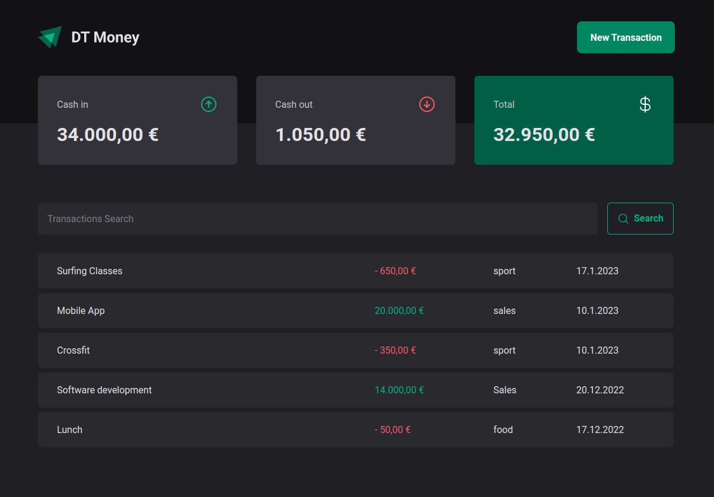
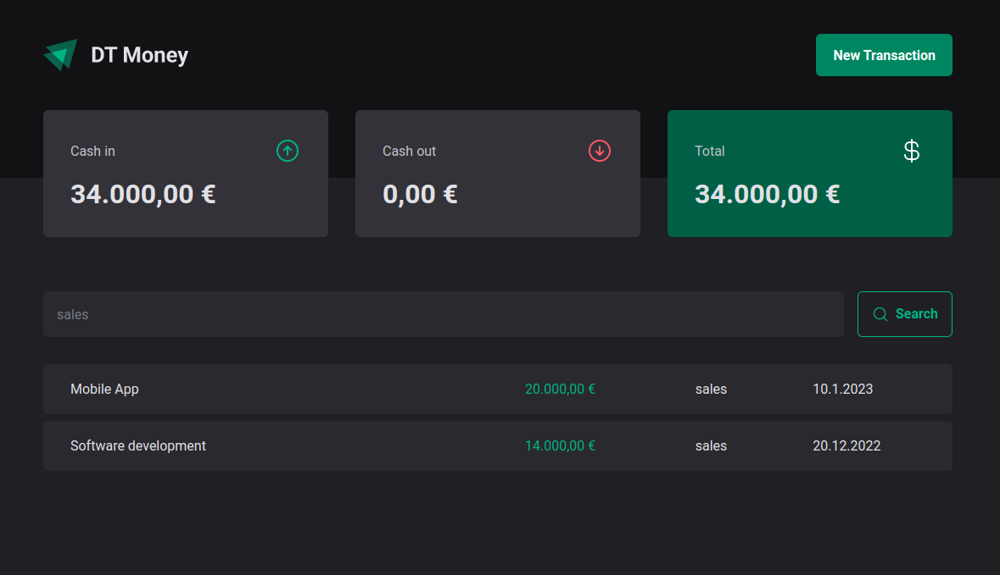
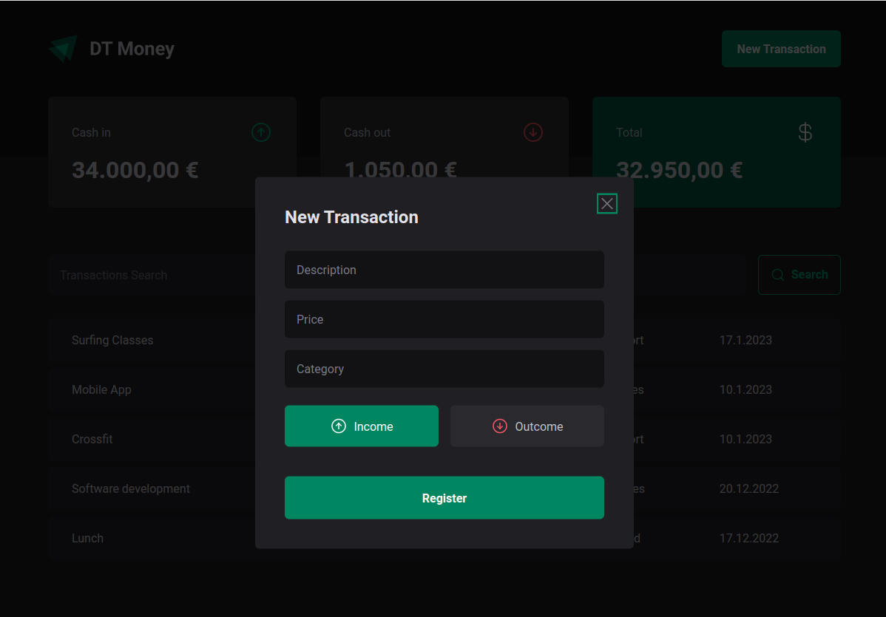

#
<p align="center" id="top">
    
</p>

<p align="center">
  <a href="#rocket-tecnologias">Tecnologias</a>&nbsp;&nbsp;&nbsp;|&nbsp;&nbsp;&nbsp;
  <a href="#-projeto">Projeto</a>&nbsp;&nbsp;&nbsp;|&nbsp;&nbsp;&nbsp;
  <a href="#-layout">Layout</a>&nbsp;&nbsp;&nbsp;|&nbsp;&nbsp;&nbsp;
</p>
<br>

<p align="center">
	
	
	
</p>

---
## 🚀 Technologies ##

This project was developed using the following technologies:

- [React](https://pt-br.reactjs.org/)
- [Vite](https://vitejs.dev/)
- [TypeScript](https://www.typescriptlang.org/)
- [Styled-components](https://styled-components.com/)
- [Radix](https://www.radix-ui.com/)
- [Zod](https://github.com/colinhacks/zod/)
- [React Hook Form](https://react-hook-form.com/)
- [Phosphor](https://phosphoricons.com/)
- [Axios](https://axios-http.com/docs/intro)
- [JSON server](https://github.com/typicode/json-server)
<br>

---

## 📋  Requirements ##

Before starting you need :checkered_flag:, have installed the [Git](https://git-scm.com) e [Node](https://nodejs.org/en/).

<br>

---
## ⌨ How to run the project ##

```bash
# Clone this project
$ git clone git@github.com:Ca-byte/ignite_dt_money.git

# Access
$ cd ignite-dt-money

# Install dependencies
$ npm i

# Run the JSON server
$ npm run dev:server

# Run the project
$ npm run dev

# The server will initialize in the <http://localhost:5173/>

```
<br>

---

## 💻 Project

The project idea is a financial control app where we add and track inputs, outputs and the total. We can register new transactions, search and filter them. We use accessibility and form libraries to make even more beautiful our project.

This is a project developed during React bootcamp **[Ignite](https://github.com/Rocketseat)**, run by **[@Rocketseat](https://github.com/Rocketseat)**.

<br>

---

## 🔖 Layout ##

- [Ignite DT Money](https://www.figma.com/file/HlGKNxhQi3Tt8QfE3bKrhy/DT-Money-(Community)?t=LviCMoQQNUWnr3TK-0)

Remembering that you need to have a [Figma](http://figma.com/) account to access it.

---


<br>
<p align="center">Developed with 💜 by Caroline Vieira</p>

<a href="#top">☝</a>